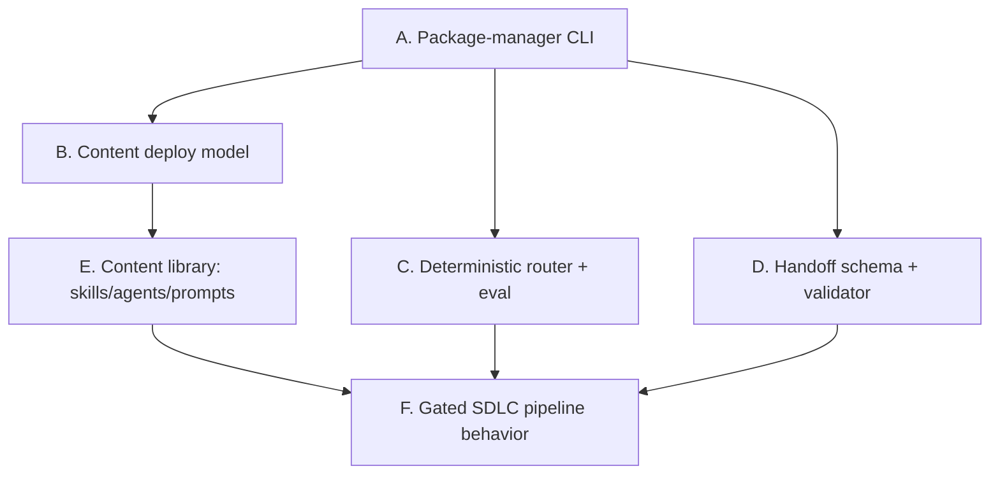

# 00 — Reverse-Engineering Plan

> **Goal of this document:** a concrete, repeatable *plan* to (a) reverse-engineer **what this
> system does for users and how they use it**, and (b) re-build the same functionality cleanly.
> The remaining numbered files are the *output* of executing this plan; this file is the *method*.

---

## 1. Objectives & definition of done

You are done reverse-engineering when you can answer, for every feature, all five questions:

1. **What** does it do (observable behavior / output)?
2. **Who** triggers it and **how** (command, slash-command, natural-language phrase)?
3. **What are the inputs** (files, env vars, git state, user replies)?
4. **What are the guarantees & guardrails** (what it will *never* do; exit codes; gates)?
5. **How do we verify** a re-implementation matches (an executable test)?

The re-implementation is done when a fresh codebase (Python *or* TypeScript) passes the
language-neutral test suite in [11-TEST-SPECIFICATION.md](11-TEST-SPECIFICATION.md) and a human
can complete every journey in [10-USER-WORKFLOWS.md](10-USER-WORKFLOWS.md).

---

## 2. The system decomposes into 6 independently-verifiable subsystems

Reverse-engineer and rebuild these in dependency order. Each has a "source of truth" you read to
recover behavior, and a "verification" you write to lock it in.

| Subsystem | Source of truth to read | What it produces for users | Verify with |
|---|---|---|---|
| **A. CLI engine** | the CLI module (argparse/commander surface) | install/update/list/status/clean/doctor of content | CLI behavior tests (file 11 §A) |
| **B. Deploy model** | the download + copy + hash-diff + deploy-state code | content lands in IDE folders; user edits preserved | deploy tests (file 11 §A) |
| **C. Router + eval** | `router.py`, `_router_core.py`, `runner.py` | routing accuracy is a CI gate | router/score tests (file 11 §C) |
| **D. Handoff contract** | `handoff-payload.schema.json`, `schema_validate.py` | typed inter-agent contract; `validate-handoff` | schema tests (file 11 §D) |
| **E. Content library** | each `SKILL.md` / `.agent.md` / `.prompt.md` frontmatter + headings | the actual AI capabilities | eval_queries + budget tests (file 11 §E) |
| **F. Pipeline behavior** | agent bodies + `_shared/agent-invariants.md` | the gated Jira→PR SDLC flow | pipeline behavior tests (file 11 §F) |

**Key insight that makes this tractable:** the *engine* (A–D) is small, deterministic, and
stdlib-only — recover it exactly. The *content* (E–F) is prose you must **re-author, not copy** —
recover only its **contract** (frontmatter fields, trigger phrases, guardrails, output paths,
handoff payloads), then rewrite the body from public sources.

---

## 3. Method — how to extract behavior from each artifact type

### 3.1 The CLI engine (subsystem A/B)
1. Enumerate every subcommand and its flags from the argument-parser definition.
2. For each command, trace the handler to record: **preconditions**, **filesystem effects**,
   **network calls**, **stdout/stderr shape**, and **exit code**. Capture these as a behavior
   table (done for you in file 02).
3. Extract all **module-level constants** (base-skill set, excluded set, managed prefixes,
   default target paths per-OS, thresholds, cache filename). These are the tuning knobs.
4. Note every **idempotency / preservation rule** (skip-if-present, hash-diff to detect
   "unchanged", preserve user-modified files unless `--force`). These are the subtle behaviors
   users depend on.

### 3.2 The router (subsystem C)
1. The algorithm is standard IR (IDF-weighted cosine over stemmed unigrams + bigrams, with flat
   bonuses and override tables). Recover the **formula and constants** (file 03), not the exact
   wording of the calibration tables.
2. Treat the calibration tables (coordinator phrases, role aliases, strong/phrase signals, veto
   phrases, stopwords, stemmer suffixes) as **your own to re-derive** for your agent set — they
   are matcher tuning, not behavior. Rule: **never edit the published `eval_queries.json` to force
   a pass**; tune the matcher instead.
3. Lock the **route-score ≥ 0.95** CI threshold and the deterministic tie-break (by agent name).

### 3.3 The handoff schema (subsystem D)
1. Transcribe the JSON Schema **structure** (it's a public spec: JSON Schema 2020-12): universally
   required fields, enums, `additionalProperties:false`, and every `if/then` per-phase block.
2. Recover the **validator's two modes**: full JSON-Schema validation when a library is present,
   and a **stdlib fallback** covering required/additionalProperties/enum/bounds/conditional-required.
3. Recover the loader behavior (JSON *or* YAML; minimal flat-YAML fallback) and the CLI exit-code
   contract (0 valid, 1 schema violation, 2 unreadable/unparseable).

### 3.4 The content library (subsystem E/F) — the clean-room-sensitive part
For **each** skill/agent/prompt, extract only the **contract**, then re-author the body:
1. **Frontmatter** — `name`, `description` (the router reads this — keep its *trigger phrases'
   intent*, reword the prose), `tools:` (agents), `agent`/`mode` (prompts).
2. **Structural contract** — the section headings the body must contain (Quick Prompts, Summary,
   When to Use, Inputs, Guardrails, Workflow, Output format), which references/steps/scripts it
   owns, and any **script entry points** (`main(argv)`).
3. **Behavioral contract** — inputs, outputs, output file paths, guardrails ("review-only",
   "never auto-commit"), and (for agents) the **handoff payload** it emits + the invariants it
   obeys.
4. **eval_queries.json** — the count and *shape* (positive/negative), not the exact strings; write
   your own trigger/negative queries for your reworded descriptions.
Then **write the body yourself** from the public sources in file 05 + your domain knowledge.

### 3.5 User workflows (the "how users use it" deliverable)
Reconstruct end-to-end journeys from the docs + CLI help + agent bodies. For each journey capture:
entry command/phrase → sequence of prompts → approval points → produced artifacts → maintenance.
This is [10-USER-WORKFLOWS.md](10-USER-WORKFLOWS.md).

---

## 4. Verification strategy (how you know the clone is correct)

Three tiers, cheapest first — all runnable in CI with no network and no LLM:

1. **Engine parity tests** (subsystems A–D). Port the language-neutral cases in file 11 §A–D.
   These are exact: same inputs → same outputs / exit codes / deploy state. Includes the
   "preserve user-modified files", "base skills always installed", "route-score ≥ threshold",
   and "handoff schema per-phase required fields" behaviors.
2. **Content contract tests** (subsystem E–F). Assert each authored artifact meets its **budgets**
   and **structural rules** (SKILL.md ≤ 500 lines hard / ~5000 tokens warn; description length;
   agent description ≤ ~1500 chars; every agent references the shared invariants; every
   skill/agent has an `eval_queries.json`), and that `route-score` over your agents stays green.
3. **Human journey walkthrough** (subsystem F). Manually run each journey in file 10 in a real IDE
   to confirm slash commands resolve and the gated pipeline pauses/loops as specified.

**"Independent test" discipline** (mirrors the original): author verification from the *requirement*
(this spec) — never from the implementation's own tests — and use **stub routers / temp
catalogs / synthetic payloads**, so a bug copied into both code and test can't hide.

---

## 5. Work breakdown & sequencing

A suggested order that keeps every step shippable and testable:

**Milestone 1 — Engine skeleton (no content yet)**
1. Scaffold the package/CLI with an empty command that prints `--version`.
2. Implement path resolution (per-OS targets) + the argument surface (all subcommands, flags).
3. Implement `list` / `status` against a local content dir. *Test: file 11 §A list/status.*

**Milestone 2 — Deploy model**
4. Implement download (shallow clone of a ref), copy-to-target, dir hash-diff, deploy-state cache.
5. Implement `install` / `update` / `uninstall` / `clean` with base-skill + preserve rules.
   *Test: file 11 §A/B install/preserve/clean.*

**Milestone 3 — Deterministic gates**
6. Implement the router + eval runner + `eval` / `route-score`. *Test: file 11 §C.*
7. Implement the handoff schema + validator + `validate-handoff`. *Test: file 11 §D.*

**Milestone 4 — Prove the content loop (thin vertical slice)**
8. Author 4 base skills + 1 `code-review` skill + the format contracts. *Test: file 11 §E budgets.*
9. Author the coordinator + the 7 role agents + `kb` companion + `_shared` invariants + the 13
   prompts. Give each an `eval_queries.json`. *Test: `route-score` ≥ 0.95, invariants present.*

**Milestone 5 — Fill out the catalog & wire CI**
10. Author the remaining ~29 skills (most are generic engineering tasks; see file 06).
11. Wire CI to run `route-score`, `eval`, `validate-handoff`, and the budget validator on every PR.

**Milestone 6 — Org substitution & E2E**
12. Replace all org placeholders (§ README table). Point at your endpoints/branches/prefix.
13. Walk every user journey (file 10) in a real IDE.

---

## 6. Risks & how the design mitigates them (recover these too)

| Risk | Original's mitigation you must reproduce |
|---|---|
| CLI self-lock on Windows when overwriting a running `.exe` | `update` refreshes **content only**, never the CLI package; CLI upgrades go through the package installer separately. |
| Non-deterministic AI output | Agents must **load the skill file before acting**; skills are budgeted, self-contained procedures. |
| Routing correctness can't be tested without an LLM | The **deterministic router** makes routing a stdlib CI gate. |
| Inter-agent drift | The single **handoff JSON Schema** every phase must satisfy, validated offline. |
| Unreviewed code shipped | Git mutations restricted to **one agent** (Release), only after the final gate. |
| Runaway auto-fixing | Revision loops **capped at 3 cycles per phase** (Test + Review share the counter). |
| Oversized changes | Implementation measures the diff and **hands back to Planning** at > 8 files or > 400 code lines. |
| Offline / air-gapped consumers | Engine is **stdlib-only**; heavy deps (embeddings) are optional extras with deterministic fallbacks. |

---

## 7. Deliverables checklist (this spec)

- [x] Reverse-engineering method + work breakdown — *this file*
- [x] Platform-agnostic system overview — file 01
- [x] CLI engine behavioral spec (all commands) — file 02
- [x] Router algorithm spec — file 03
- [x] Handoff contract + validator spec — file 04
- [x] Content format + budget spec — file 05
- [x] Full skills inventory (34) — file 06
- [x] Full agents + invariants spec (9) — file 07
- [x] Prompts inventory (13) — file 08
- [x] Gated SDLC pipeline spec — file 09
- [x] End-to-end user workflows — file 10
- [x] Language-neutral test specification — file 11
- [x] Knowledge-base engine spec — file 12
