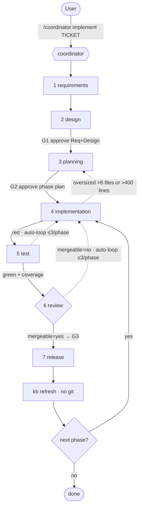

# 09 — Gated SDLC Pipeline Spec (platform-agnostic)

This is the behavior the content encodes: how a single entry (`/<PREFIX>coordinator implement
<TICKET>`) walks a ticket from idea to merged PR, with three human gates and automatic revision
loops. Behaviors tagged `CR-PIPE-NNN`.

---

## 1. The flow



## 2. The three approval gates (CR-PIPE-001)

| Gate | Fires after | Presents | User options | Pass requires |
|---|---|---|---|---|
| **G1** | Design | Requirements + Solutions summaries + coverage report | approve / revise (Req or Design) / abort | coverage pass or every ❌ waived |
| **G2** | Planning | Implementation package + phase list + coverage | approve / revise / abort | every phase ≤ 8 files & ≤ 400 lines; ❌ waived |
| **G3** | Review | review summary + findings + `mergeable` | approve (→ Release) / revise (→ Implementation) / abort | `mergeable:yes` (0 open findings at all severities) |

**All other boundaries auto-progress.** The system never commits/pushes/merges without an explicit
approval at these three gates. The **single G3 approval** covers the entire Release sequence and the
KB refresh.

## 3. Auto-progression boundaries (no user prompt) (CR-PIPE-002)

Requirements→Design, Design→Planning, Planning→Implementation, Implementation→Test all auto-hand off
on a clean self-review. Test→Review and Review→Release are conditional (see loops).

## 4. Conditional Design skip (CR-PIPE-003)

Design may be skipped **only** when Requirements mode is lightweight **and** the ticket is "very
small" (single-file change, no design decision). Design **always** runs for full-mode, PR-comment-
fix flows, and multi-file changes.

## 5. Revision loops (auto, silent, capped) (CR-PIPE-004)

- **Test → Implementation:** Test `gate:red` (failures or coverage breach) ⇒ coordinator silently
  re-dispatches Implementation in revision mode.
- **Review → Implementation:** Review `mergeable:no` (any open P0–P3) ⇒ coordinator silently
  re-dispatches Implementation in revision mode. **Same counter** as the Test loop.
- **Cap = 3 cycles per phase**, shared between the two loops. On the 3rd failure ⇒ adaptive
  escalation: propose re-route to Planning or Requirements, record the decision, let the user choose
  (accept re-route / approve-as-is / abort / extend one cycle — never auto-extend).
- Revision mode **never branches** — the agent stays on the phase branch and amends in place; Test
  and Review reports **append** a `## Revision <cycle>` section (never overwrite).

## 6. Phase sizing & oversized handback (CR-PIPE-005)

- **Policy:** each phase ≤ **8 files** AND ≤ **400 changed code lines** (generated files, lockfiles,
  snapshot baselines, committed fixtures, docs excluded from the line count; newly-added files still
  count toward the file cap).
- **Detection:** Implementation checks at pre-flight, mid-flight, and pre-handoff. A breach ⇒ emit
  `status:handback_to_planning, oversized_phase:true, measured_files, measured_lines, resplit_reason`,
  leave the tree intact, and Planning re-splits (`resplit_from:PHASE-NNN`), refreshes coverage,
  re-runs G2, and Implementation resumes on the first new sub-phase.

## 7. Chained branch model (CR-PIPE-006)

```
<DEV_BRANCH>
  └─ feature/<TICKET>-<slug>/integration        (stack root; coordinator creates up-front)
       ├─ feature/<TICKET>-<slug>/phase-001      (off integration)
       │    └─ feature/<TICKET>-<slug>/phase-002 (off phase-001)   → …
       └─ (parallel phases branch off integration directly)
```

- **PR targets:** phase-001 → integration; phase-NNN (N≥2) → phase-(NNN-1); integration → `<DEV_BRANCH>`.
  Parallel phases → integration. PRs merge **oldest-first**.
- **Never** use a bare `feature/<TICKET>-<slug>` ref (collides with `…/phase-NNN` children in git).
- Only **Release** performs the commit/rebase/push/PR, only after G3.

## 8. Modes (CR-PIPE-007)

| Mode | When | Documents |
|---|---|---|
| **full** | new feature / RFC / unstructured request; or user asks | all packages, 18-section design, full templates |
| **lightweight** | Jira-only entry; small/bug fix; or user asks | minimal docs; Jira description + tiny templates; Design may be skipped |

Requirements picks the mode and **propagates it** to every downstream agent via the `mode` field;
downstream agents must match it. Force full at the routing gate with `mode: full, approved`.

## 9. Multi-phase & parallel runs (CR-PIPE-008)

- **Multi-phase:** the coordinator loops Implementation→Test→Review→Release **per phase**, advancing
  after each phase's Release; Review emits `phases_total/completed/pending/next_phase_id` to drive
  the loop; KB refresh optionally runs after the last phase.
- **Parallel:** when marked `parallel:true`, phases branch off integration directly and run
  Implementation→Test concurrently; **all** parallel phases must clear Test before Review (Review is
  single-threaded); their PRs target integration.

## 10. Knowledge-base companion (CR-PIPE-009)

- Developer-local under `ai_generated_docs/kb/` (gitignored). The **KB is current truth** — there's
  no separately-maintained master requirements/solution package.
- **Self-heals:** `kb-universal` runs an auto/prompt refresh at session start and whenever an SDLC
  skill loads the KB (cheap `git fetch <DEV_BRANCH>` surfaces drift; only changed topics regenerate).
- The `kb` agent is the **post-release** backstop: verify the PR merged, reconcile the KB against
  merged source, offer to delete absorbed planning deltas. **Zero git mutations**; runs under the
  same G3 approval.

## 11. Direct agent invocation & resume (CR-PIPE-010)

Any role agent can be invoked directly; it **backfills** missing upstream artifacts (with user
confirmation and matching mode) before doing its own work — enabling mid-pipeline resume (e.g.
re-enter at `/<PREFIX>review`). The coordinator's durable state record enables resuming an
interrupted run from the last completed phase.

## 12. Artifact layout produced (CR-PIPE-011)

```
ai_generated_docs/
├── reports/
│   ├── coordinator/<jira>-<ts>-state.yml        # durable pipeline state
│   ├── design|planning|implementation/…         # FR-019 coverage reports
│   ├── test|review|release/…                     # phase reports
│   └── kb/…                                       # post-release refresh summaries
├── Jira-tickets/<EPIC>-<slug>/<TICKET>-<slug>/
│   ├── MANIFEST.yml                              # mode, owners, gate decisions, FRs, status
│   ├── 01-requirements/ · 02-solutions/ · 03-implementation/
└── kb/                                           # developer-local knowledge base (gitignored)
```

## 13. User-facing guarantees (CR-PIPE-012)

No auto-commit/push; exactly three approval gates; independent Test gate before Review; 3-cycle
revision cap with adaptive escalation; phase-size policy with automatic re-split; credential secrecy
(env vars only, never echoed/committed); spec compliance CI-enforced; runtime distribution (no local
clone); offline KB fallback (deterministic stub embedder when the real model is unavailable).
